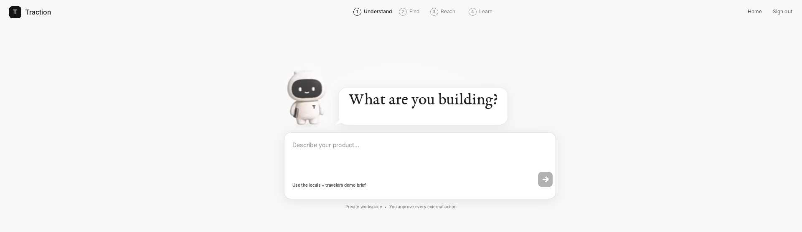
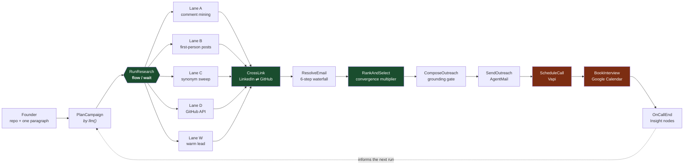
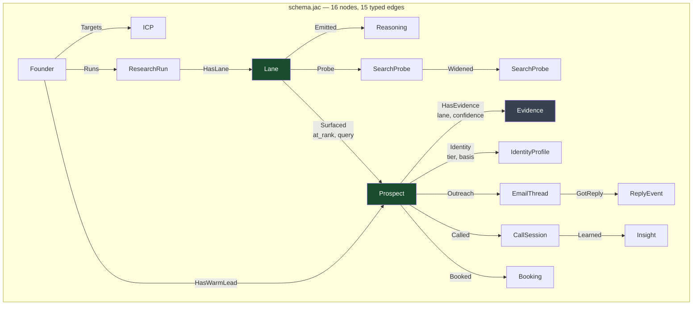
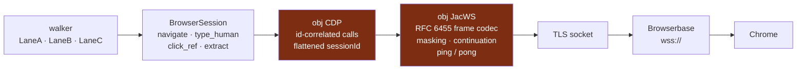
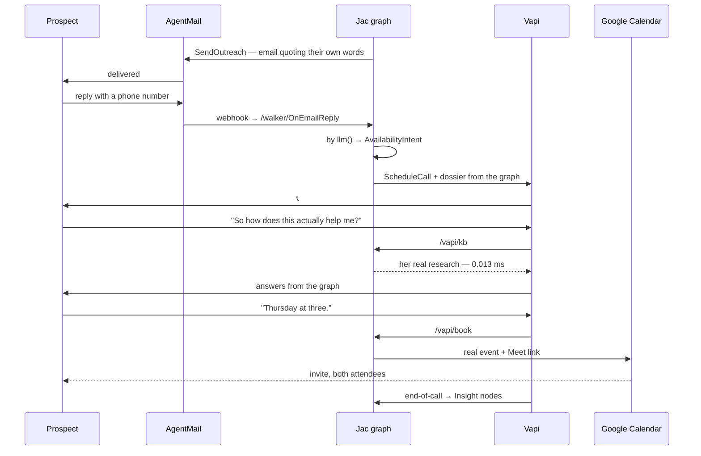

<div align="center">

# traction

### Tell it what you're building. Wake up with your week booked with the people who need it.

**It finds the people already describing your problem in public, proves each one is the same human on LinkedIn and on GitHub, and learns enough about them to write something actually worth answering — then emails them, texts them, and calls them. It follows up. It answers their questions. It re-pitches the ones who cancel. It books the interview on your calendar. Every call it finishes sharpens the next one. You just show up.**

<a href="https://devpost.com/software/traction-6se7mr">
  
</a>

**Understand** what you're building · **Find** who has the problem · **Reach** them the way you would · **Learn** from every reply

**[▶&nbsp; View the demo](https://devpost.com/software/traction-6se7mr)**

*Built in Jac · 🏆 Winner, Agentic AI Track · JacHacks SF 2026 · Founders, Inc., Fort Mason*

</div>

---

## The problem, stated as one person

A founder shipped something last week. They need ten people who actually have the problem they're solving — not a market, ten humans.

So they open LinkedIn, read a comment, guess at someone's GitHub handle, hope it's the same person, write an email that sounds like every other cold email, and get ignored. That is the first month of a startup, spent on tab-switching.

**Those people have already told you they have the problem.** They complained about it in a LinkedIn comment. They filed an issue about it on GitHub. The signal is public — it is just split across two platforms that do not know about each other.

traction's thesis is therefore a claim about identity: **if you can find the same human independently from two directions, you know something real about them.**

That claim is not a feature layered on top of a data model. It *is* the data model — one graph traversal.

---

## What it does



Give it your repo, a paragraph on what you're building, and optionally one warm lead:

1. **`PlanCampaign`** turns the paragraph into a searchable hypothesis — keywords, pain phrases, and *negative* keywords so vendors selling the solution never surface as people who have the problem.
2. **Five lanes launch in parallel.** Three drive real Chrome browsers on LinkedIn with different doctrines. One works GitHub programmatically. One deep-researches the named warm lead.
3. **Lanes cross-link asymmetrically** — heavy in one direction, light in the other.
4. **The email gate is a hard filter**, not a score. Anyone unreachable is dropped visibly, with a written reason.
5. **Convergence scores what matters.** A prospect surfaced by two independent lanes gets a multiplier.
6. **`ComposeOutreach` quotes their own words back** — and refuses to send if it cannot prove the quote is grounded in stored evidence.
7. **When they reply, an AI calls them**, answers their questions from the graph mid-call, and books the meeting with a Google Meet link on both calendars.

---

## Where Jac runs

**The graph is the product.** Not a persistence layer beneath the product — the product.



### The convergence query is one line

The closing shot — *"this human was found independently from two directions"* — is a traversal back up the `Surfaced` edges:

```jac
lanes_that_found_them = [p <-:Surfaced:<- [?:Lane]];
if len(lanes_that_found_them) > 1 {
    p.score *= CONVERGENCE_MULTIPLIER;   # 0.71 -> 0.94
}
```

In a relational store that is a join plus a `GROUP BY` plus a dedupe pass. Here the score multiplier falls out of the shape of the graph.

### The dry-branch ladder is graph structure, not an if-chain

When a search angle goes dry, the walker **grows a child node and visits it**. The traversal deepens exactly where the search struggled — so the search tree, dead branches included, is a graph fact you can render with `printgraph`, not a log line:

```jac
if not yielded {
    wider = here +>:Widened(because="dry"):+> SearchProbe(
        rung=here.rung + 1, move="widen_date_window",
        reason="nine queries run, nothing kept - widening rather than reporting zero"
    );
    visit wider;
}
```

This is what makes these walkers genuine traversal rather than RPC in walker costume.

### Real parallelism with `flow` / `wait`

Five lanes, five threads, one barrier. Measured: four 0.6 s tasks complete in **0.60 s wall clock**, and lane intervals are asserted to *overlap* rather than merely finish fast.

```jac
futures = [flow run_lane(x.node, x.lane_id, ctx, hypothesis,
                         x.phrases_json, offline, x.fixture_json, deadline)
           for x in [spec]];
results = [wait f for f in futures];
```

### `by llm()` with `sem` — 14 abilities, 156 semantic annotations

Jac's LLM binding is typed. You declare the return object and annotate it; the language handles the call, the schema, and the retry:

```jac
obj CommentVerdict {
    has index: int;
    has is_pain: bool = False;
    has is_vendor: bool = False;
    has relevance: float = 0.0;
}
sem CommentVerdict.is_pain = "True only if the author is describing a difficulty
    they themselves are experiencing, in the first person. Congratulation,
    agreement, and abstract commentary are all False.";

def classify_texts(hypothesis: str, texts: list[str]) -> list[CommentVerdict] by llm();
```

### `walker:pub` is the integration surface — zero routing glue

Five external services talk to this system. **There is not one line of routing code.** Each service POSTs directly into a walker; the language generated every endpoint:

| Endpoint | Caller | Fires |
|---|---|---|
| `/walker/RunResearch` | dashboard | the five-lane fan-out |
| `/walker/OnEmailReply` | AgentMail webhook | reply parsing → call scheduling |
| `/vapi/kb` | Vapi, **mid-call** | graph lookup, answers in **0.013 ms** |
| `/vapi/book` | Vapi, **mid-call** | resolves spoken time → Google Calendar |
| `/walker/OnCallEnd` | Vapi end-of-call | transcript → `Insight` nodes |
| `/ws/walker/LiveFeed` | dashboard | WebSocket broadcast |

**22 public walkers.** The frontend is a Jac `cl { }` client in the same program — one `jac start` serves the React UI and the graph engine from one process, over one anchor store.

---

## The centerpiece: a WebSocket and Chrome DevTools client written in Jac

**2,284 lines of `browser/*.jac`. No Playwright. No Puppeteer. No Stagehand. No SDK.**

Jac's own browser tool speaks `ws://`; Browserbase requires `wss://`. So the transport was implemented from the socket up, in Jac:



- **`obj JacWS`** — RFC 6455 frame masking, continuation reassembly, ping/pong, verified **byte-exact against the §5.7 spec vector**.
- **`obj CDP`** — id-correlated request/response over one socket, flattened `sessionId` routing, per-instance counters so five lanes in five threads cannot steal each other's replies.
- **`obj Browserbase`** — sessions, persistent auth contexts, live-view URLs, release.

**Owning the transport is measurable.** `type_human` was RTT-bound at **224 ms per keystroke** — each character cost two blocking round-trips. Pipelining the frames brought it to **59 ms**. That optimisation is unavailable through a blocking SDK; it exists only because this stack owns its wire protocol.

---

## Research doctrine

Three LinkedIn lanes are not three views of one search. They are three researchers with different theories of where signal lives.

| Lane | Doctrine | Why |
|---|---|---|
| **A** | Mines comment sections under **mid-tier** practitioners | Comment sections under mega-accounts are applause, not signal. At 200–3,000 followers the commenters are peers actually working on the problem. |
| **B** | Reads post bodies for **first-person** problem statements | Third-person analysis is not evidence someone has the problem. |
| **C** | Sweeps **synonym vocabulary** | Coverage against phrasing lock-in. |
| **D** | GitHub API, programmatic | Depth lives in the API, not the UI. |
| **W** | Deep-researches one named warm lead | The founder's own highest-intent contact. |

### Cross-linking is deliberately asymmetric

**LinkedIn → GitHub is heavy.** Contact-info modal, About regex, post history for shared repo links — then disambiguated by *organisation membership*, never the user-editable company field.

**GitHub → LinkedIn is light.** Headline, current company, About excerpt. The technical evidence already exists; only the professional frame is missing.

### The email waterfall — six steps, then a drop

Email is a **hard gate**, not a scoring factor. A prospect we cannot reach is not a prospect.

1. Profile email field
2. Global commit search (`search/commits?q=author:`) — the workhorse
3. Per-repo commits at `per_page=100`
4. `.patch` header on any public commit
5. Personal site linked from the profile
6. LinkedIn contact-info modal

Addresses are attributed, not merely found: a forked repo's manifest yielding the *upstream* author's email is caught, and so is a machine hostname masquerading as a mailbox. Everything dropped is shown with the reason:

```
[KEEP] willregelmann   will@regelmann.net   taken from commits they authored themselves
[DROP] djny45                               waterfall exhausted all six steps
```

Measured on a live run: **14 surfaced → 11 resolved (79%) → 3 selected, 3 dropped with written reasons.**

---

## The conversation layer



**The voice agent reads the same graph the browsers wrote to ninety seconds earlier.** That is the architectural payoff of a persistent graph rather than a request-scoped pipeline.

**Two rules the agent cannot violate.** The server resolves what was said into a datetime — the model never decides the slot, so a misheard time raises instead of confidently booking the wrong one. And every calendar invite records what it heard, what it resolved, and the evidence:

```
Heard on the call: "Thursday at 3PM"
Resolved to:       Thursday, July 30th at 3 PM Pacific (upcoming weekday)
What we found:     "Hi, this is Xingzhi (Becky) Zhu, UCLA alum double majoring
                    in Business Economics and Statistics. My fields of interest
                    are analytics and product management."
```

---

## Composition guarantees

**The grounding gate.** `ComposeOutreach` refuses to draft unless the graph holds something this person actually wrote or built, and refuses again if the drafted body does not quote it verbatim. Given an empty graph it declines rather than improvises:

> *"a headline on its own does not count — it is a job title, not something they said."*

**Scraped text is truncated at its source boundary.** LinkedIn's "More profiles for you" sidebar bleeds other people's names and employers into an About section. Every citation is cut at the earliest such marker, at both the extraction and the assembly layer — measured on a real contaminated string: 285 → 156 chars, five strangers removed, the subject's own sentence intact.

**Identity tiers state their basis.** `VERIFIED` requires corroboration by name match or verified org membership. Without it the profile still attaches at `PROBABLE 0.74` with a basis reading *"nothing corroborated it"* — visible for a human to adjudicate, never promoted onto a card or into an email.

---

## Numbers

| | |
|---|---|
| **Jac in the product path** | **100%** — no Python, no JavaScript |
| **Jac lines** | 22,172 across 62 `.jac` files |
| **Graph** | 16 node types · 15 typed edges with declared endpoints |
| **Walkers** | 30 total · 22 `walker:pub` |
| **LLM** | 14 `by llm()` abilities · 156 `sem` annotations |
| **Pure-Jac browser stack** | 2,284 lines — WebSocket + CDP + Browserbase |
| **Test suite** | 864 passing assertions |
| **Mid-call graph lookup** | 0.013 ms local · 0.43 s through the public tunnel |
| **Keystroke latency** | 224 ms → **59 ms** after frame pipelining |
| **External services · routing glue** | 5 services · **0 lines** |

Reproduce the language split yourself:

```bash
bash ops/jac_audit.sh
```

---

## Run it

```bash
# 1. Install the Jac toolchain (the binary, not the pip package)
curl -fsSL https://jaseci.org/install.sh | bash

# 2. Configure
cp .env.example .env      # Anthropic, Browserbase, AgentMail, Vapi, Google

# 3. Serve the API and the web client from one process
ops/serve.sh --port 8000 --dir .

# 4. Open the dashboard
open http://127.0.0.1:8000
```

`ops/serve.sh` runs a guest-root preflight, refuses to start against a data directory another process holds, gates readiness on a real endpoint rather than `/healthz`, and smoke-tests twelve anonymous POSTs before reporting ready.

**Repository layout**

```
schema.jac        16 nodes, 15 typed edges — the product
contracts.sv.jac  enums + LLM-visible objs + sem annotations
plan.jac          PlanCampaign — by llm() ICP synthesis
research.jac      RunResearch orchestrator + Lanes A/B/C
githublane.jac    Lane D — GitHub programmatic
lane_w.jac        Lane W — the named warm lead
identity.jac      cross-linking, email waterfall, ranking
outreach.jac      ComposeOutreach + the grounding gate
voice.jac         Vapi: ScheduleCall, mid-call tools, OnCallEnd
gcal.jac          Google Calendar + Meet
browser/          2,284 lines — WebSocket, CDP, Browserbase, in Jac
bridge.jac        13 server functions the web client calls by name
frontend.cl.jac   the dashboard — a Jac cl { } client
docs/             EVIDENCE · RUNBOOK · FRONTEND_INTEGRATION · JAC_GOTCHAS
```

---

## How far the language got pushed

A few of the things this build leans on, all of them load-bearing rather than decorative:

- **Typed edges with declared endpoints.** `Surfaced` carries the query and the rank that produced it; `HasEvidence` carries the lane and the confidence. Provenance lives on the relationship, which is where it belongs.
- **Walkers that grow the graph as they traverse.** The search ladder creates its next `SearchProbe` and `visit`s it, so the traversal deepens exactly where the search struggled.
- **`flow` / `wait` across five concurrent browser sessions**, each writing under its own lane so the threads touch disjoint edge lists and the merge runs serially after the barrier.
- **`by llm()` with `sem` as the whole LLM layer** — typed return objects, semantic annotations, no prompt strings assembled by hand.
- **`walker:pub` and `@restspec` as the integration surface**, including a raw-body function endpoint so an external service that demands its own response shape gets it without a shim.
- **A `cl { }` client in the same program as the graph engine**, so one `jac start` serves the dashboard and the walkers over one anchor store.

`docs/JAC_GOTCHAS.md` carries thirty-plus findings from getting there, each reproduced by executing code rather than reading it, each with the command that settles it.

---

<div align="center">

**The graph is not where the answer is stored. The graph is the answer.**

[▶&nbsp; View the demo](https://devpost.com/software/traction-6se7mr) · [github.com/ElijahUmana/traction_v0.1](https://github.com/ElijahUmana/traction_v0.1)

</div>
